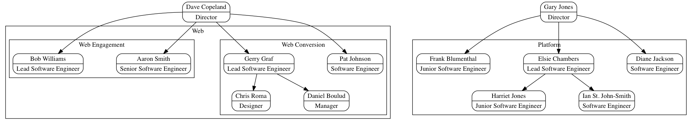

# OC - make org charts

This is a simple command-line app to generate org charts using simple JSON files and Graphviz.  It's suited to visualizing different ways of organizing teams.

## Installation

```
gem install oc
```

## Usage

1. Create `people.json` to describe all the people in the over-arching org:

   ```json
   {
     "team": {
       "members": {
         "Dave": {
           "name": "Dave Copeland",
           "title": "Director"
         },
         "Pat": {
           "name": "Pat Johnson",
           "title": "Software Engineer"
         }
       }
     }
   }
   ```

   Currently, only name and title are used.  The id (e.g. `"Pat"` above) is meaningful and is how you'll identify where people sit in the org.
2. Now create another JSON file to describe the organization structure.  Currently, this supports only two levels of hierarchy: a _division_ and a _team_.

   ```json
   {
     "divisions": [
       {
         "name": "Web",
         "teams": [
           {
             "name": "conversion",
             "label": "Web Conversion",
             "reportsTo": "Dave",
             "org": {
               "Pat": [],
               "Gerry": [ "Chris", "Daniel" ]
             }
           },
           {
             "name": "engagement",
             "label": "Web Engagement",
             "reportsTo": "Dave",
             "org": {
               "Aaron": [],
               "Bob": []
             }
           }
         ]
       },
       {
         "name": "Platform",
         "teams": [
           {
             "name": "Platform",
             "reportsTo": "Gary",
             "org": {
               "Diane": [],
               "Elsie": [ "Harriet", "Ian" ],
               "Frank": []
             }
           }
         ]
       }
     ]
   }
   ```

   Above, we have two divisions: web and platform.  Platform has only one team.  Web, however, has two teams in its division.  You can see that each team
   reports to a particular person, who is assumed to be in charge of a team or division, but not part of it formally.  Further, we can see that we allow for
   intra-team reporting.  In the Web Conversion team, Pat and Gerry report to Dave, but Gerry manages Chris and Daniel.

3. `oc org_chart.json > org_chart.dot`
4. `dot -Tpng -oorg_chart.png org_chart.dot`
5. 

Try this in `examples/`


